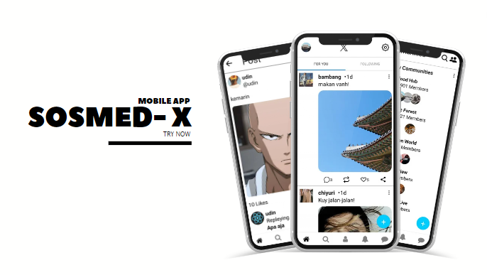

# Dikejar Kata

A Social media that offers freedom of expression and unlimited connectivity. As the only app that carries the similarities to X, we deliver an experience that goes beyond just social media. In "SOSOMED-X", you can easily create posts, "like" interesting content, explore users, and leave comments, as well as various other social features that have become commonplace in cyberspace. We bring the freedom to voice your opinion and make meaningful connections, making "SOSOMED-X" the perfect place to share, interact, and connect with the world around you.

## Features
 - has an authentication system, thus adding security to this App
 - Users create post to this app and show people around
 - Users can give likes to posts they like
 - Users can also leave as many comments as they like on each post
 - Users can create connections with following some people in this app
 - Posts are displayed based on the most recent time

## TECH
### Front-end
- Apollo Client
- React Native
- Expo
- Graphql
- React Navigation
- Expo Secure Store

### Back-end
- Apollo Server
- Bcryptjs
- Dotenv
- Graphql
- Redis
- Joi
- Jsonwebtoken
- Mongodb

